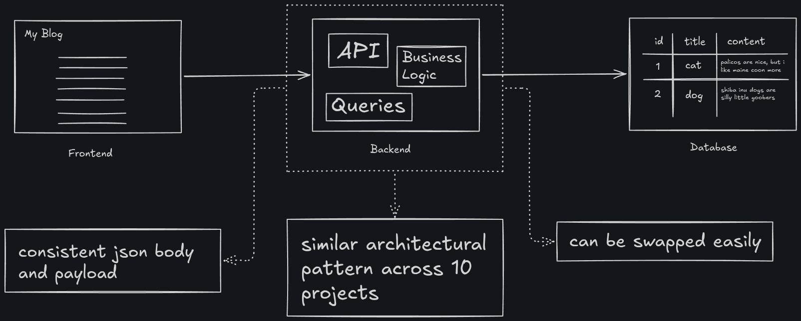

# Language+Framework Tour

## Project Overview

To become language agnostic, I decided to spend my holidays doing one simple coding project across multiple frameworks and languages to stress test my ability to shift tools according to requirements. For this project, I will use 8 languages with 10 frameworks to make a simple blogging site. The only constants in this project are the front-end using Svelte and database with PostgreSQL.

## (A Very Simplified) Overall System Design

## The Setup

For the frontend, I'm going to use Svelte since it's the only frontend framework I'm willing to use (I will never, NEVER, touch React). As for the database, I choose PostgreSQL, I find it a very reliable relational database management software (I have no idea what I just said here). Lastly, the meat of this project, the backend application. As I said, 8 languages, 10 frameworks.

## LLM Usage Disclaimer

I admit that I use LLM in this project. I use it as a very powerful search engine since we all know LLMs are trained on data (with questionable methods on how the data was obtained), and even still, I would force the LLM to cite the source of its finding rather than blindly trusting it. One thing I noticed in the process of this project is I'm getting better at reading documentations. With this project (and other subsequent fun projects that I will be doing), I will be able to be independent of LLMs and have a powerful ability of seeking information myself (or at least make a better AGENTS.md so that Claude would verify every of its output rather than excitedly tell me its explanation like an overconfident intern).

## Current Progress

Here is the list of frameworks I'm going to try out in this tour.

| Language   | Framework     | Status |
| ---------- | --------------| :----: |
| PHP        | Laravel       |   ✅   |
| GO         | Gin           |   ❌   |
| C#         | ASP.NET       |   ❌   |
| Rust       | Axum          |   ❌   |
| Java       | Spring        |   ❌   |
| Ruby       | Ruby on Rails |   ❌   |
| Python     | FastAPI       |   ❌   |   
| Python     | Django        |   ❌   |
| Typescript | ExpressJS     |   ❌   |
| Typescript | HonoJS        |   ❌   |

## Post Mortem

For each framework I 'visited', will write a post mortem where I share my thoughts on it, as well as I what I have learned, what I could have done better and decisions I've made when doing the project on the framework.

Laravel -> [PostMortem.md](backend/laravel/PostMortem.md)

